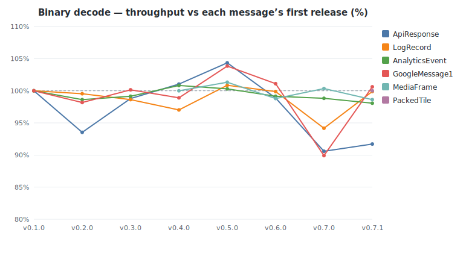
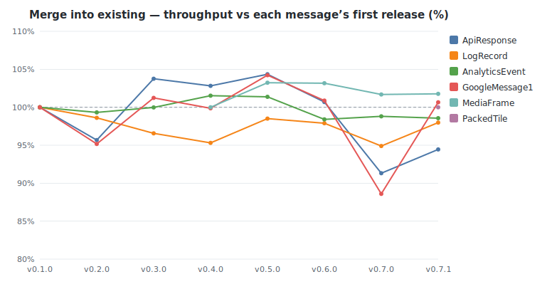
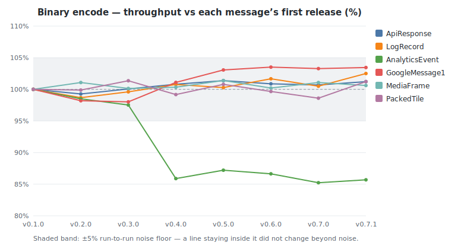
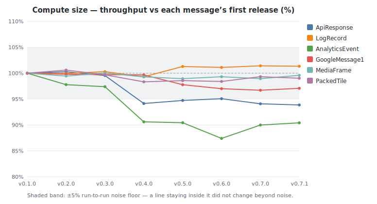
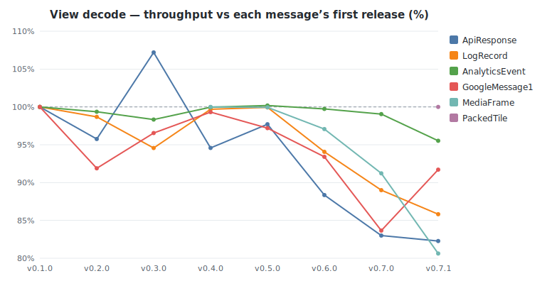
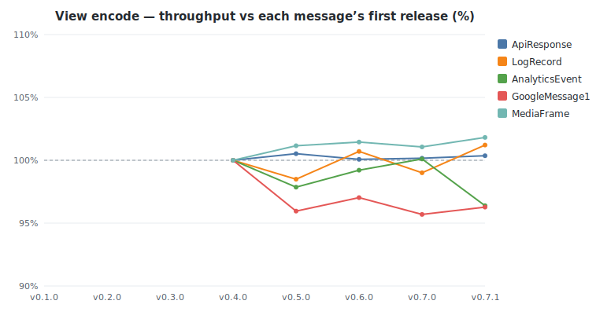
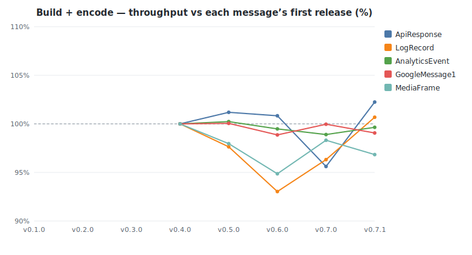
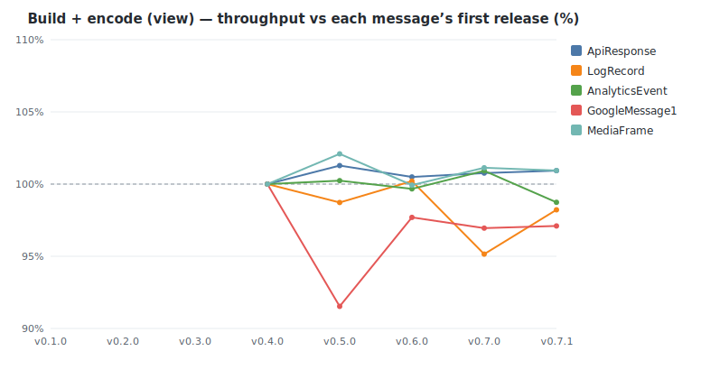
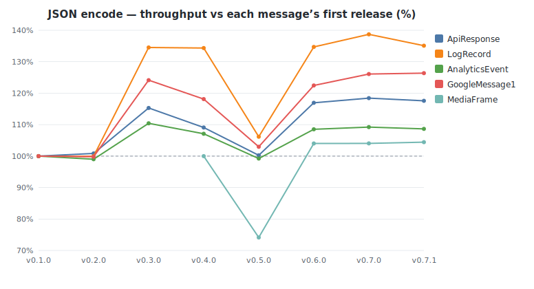
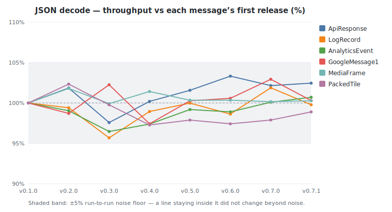

# buffa benchmark history

Throughput of buffa's own protobuf benchmarks across releases, measured on a
dedicated bare-metal box (turbo off, `performance` governor, per-core pinned).
Each release's source is built at one fixed toolchain and profile, held
constant across the series, so a delta reflects buffa's code rather than a
compiler or build-config change. The headline metric is **throughput in
MiB/s**, the median across cores, comparable across releases even when a tag's
dataset changed size. See [README.md](README.md) for methodology and caveats.

<!-- GENERATED by benchmarks/history/generate.py — do not edit by hand. -->

- Releases: v0.1.0, v0.2.0, v0.3.0, v0.4.0, v0.5.0, v0.6.0, v0.7.0, v0.7.1
- Machine: c7i.metal-24xl — Intel(R) Xeon(R) Platinum 8488C
- Tuning: turbo_disabled=1, governor=performance, pin_core=distinct-physical-per-instance
- Build profile: lto=true, codegen-units=1
- Samples: median of 4 cores per release (per-benchmark spread in run files)
- Criterion: 0.5.1 · latest measured at 2026-06-19T20:54:01Z

## Biggest movers (first tracked release → latest)

| Benchmark | First | Latest | Change | Range |
|-----------|------:|-------:|-------:|-------|
| LogRecord / json_encode | 656 | 886 | +35% | v0.1.0→v0.7.1 |
| GoogleMessage1 / json_encode | 546 | 690 | +26% | v0.1.0→v0.7.1 |
| ApiResponse / json_encode | 515 | 606 | +18% | v0.1.0→v0.7.1 |
| AnalyticsEvent / json_encode | 490 | 533 | +9% | v0.1.0→v0.7.1 |
| GoogleMessage1 / encode | 2,011 | 2,126 | +6% | v0.1.0→v0.7.1 |
| MediaFrame / json_encode | 943 | 985 | +4% | v0.4.0→v0.7.1 |
| GoogleMessage1 / json_decode | 411 | 425 | +3% | v0.1.0→v0.7.1 |
| ApiResponse / build_encode | 640 | 654 | +2% | v0.4.0→v0.7.1 |
| MediaFrame / decode_view | 45,916 | 37,020 | −19% | v0.4.0→v0.7.1 |
| ApiResponse / decode_view | 995 | 819 | −18% | v0.1.0→v0.7.1 |
| LogRecord / decode_view | 1,301 | 1,117 | −14% | v0.1.0→v0.7.1 |
| AnalyticsEvent / encode | 458 | 396 | −13% | v0.1.0→v0.7.1 |
| ApiResponse / decode | 573 | 526 | −8% | v0.1.0→v0.7.1 |
| GoogleMessage1 / decode_view | 908 | 833 | −8% | v0.1.0→v0.7.1 |
| AnalyticsEvent / compute_size | 1,380 | 1,271 | −8% | v0.1.0→v0.7.1 |
| ApiResponse / compute_size | 8,051 | 7,602 | −6% | v0.1.0→v0.7.1 |

All throughput values are MiB/s; higher is better.

## Throughput by operation (MiB/s)

### Binary decode

| Message | v0.1.0 | v0.2.0 | v0.3.0 | v0.4.0 | v0.5.0 | v0.6.0 | v0.7.0 | v0.7.1 |
|---------|------:|------:|------:|------:|------:|------:|------:|------:|
| ApiResponse | 573 | 536 (−6%) | 566 (+6%) | 579 (+2%) | 598 (+3%) | 567 (−5%) | 519 (−8%) | 526 (+1%) |
| LogRecord | 465 | 463 (−0%) | 458 (−1%) | 451 (−2%) | 469 (+4%) | 464 (−1%) | 438 (−6%) | 464 (+6%) |
| AnalyticsEvent | 125 | 123 (−1%) | 124 (+1%) | 126 (+2%) | 125 (−1%) | 124 (−1%) | 124 (−0%) | 123 (−1%) |
| GoogleMessage1 | 640 | 628 (−2%) | 641 (+2%) | 633 (−1%) | 665 (+5%) | 647 (−3%) | 575 (−11%) | 644 (+12%) |
| MediaFrame | — | — | — | 10,383 | 10,521 (+1%) | 10,257 (−3%) | 10,419 (+2%) | 10,239 (−2%) |
| PackedTile | — | — | — | — | — | — | — | 207 |

### Merge into existing

| Message | v0.1.0 | v0.2.0 | v0.3.0 | v0.4.0 | v0.5.0 | v0.6.0 | v0.7.0 | v0.7.1 |
|---------|------:|------:|------:|------:|------:|------:|------:|------:|
| ApiResponse | 721 | 690 (−4%) | 748 (+8%) | 741 (−1%) | 752 (+1%) | 726 (−4%) | 658 (−9%) | 681 (+3%) |
| LogRecord | 724 | 714 (−1%) | 699 (−2%) | 690 (−1%) | 713 (+3%) | 709 (−1%) | 687 (−3%) | 710 (+3%) |
| AnalyticsEvent | 152 | 151 (−1%) | 152 (+1%) | 154 (+2%) | 154 (−0%) | 149 (−3%) | 150 (+0%) | 149 (−0%) |
| GoogleMessage1 | 828 | 788 (−5%) | 838 (+6%) | 827 (−1%) | 863 (+4%) | 835 (−3%) | 733 (−12%) | 833 (+14%) |
| MediaFrame | — | — | — | 13,978 | 14,429 (+3%) | 14,419 (−0%) | 14,213 (−1%) | 14,225 (+0%) |
| PackedTile | — | — | — | — | — | — | — | 255 |

### Binary encode

| Message | v0.1.0 | v0.2.0 | v0.3.0 | v0.4.0 | v0.5.0 | v0.6.0 | v0.7.0 | v0.7.1 |
|---------|------:|------:|------:|------:|------:|------:|------:|------:|
| ApiResponse | 1,962 | 1,946 (−1%) | 1,965 (+1%) | 1,927 (−2%) | 1,973 (+2%) | 1,951 (−1%) | 1,984 (+2%) | 1,957 (−1%) |
| LogRecord | 3,086 | 3,056 (−1%) | 3,036 (−1%) | 2,974 (−2%) | 3,039 (+2%) | 3,060 (+1%) | 3,046 (−0%) | 3,013 (−1%) |
| AnalyticsEvent | 458 | 455 (−1%) | 467 (+3%) | 395 (−15%) | 395 (−0%) | 404 (+2%) | 401 (−1%) | 396 (−1%) |
| GoogleMessage1 | 2,011 | 2,028 (+1%) | 2,023 (−0%) | 2,037 (+1%) | 2,109 (+4%) | 2,090 (−1%) | 2,093 (+0%) | 2,126 (+2%) |
| MediaFrame | — | — | — | 25,595 | 25,629 (+0%) | 25,919 (+1%) | 25,711 (−1%) | 25,529 (−1%) |
| PackedTile | — | — | — | — | — | — | — | 475 |

### Compute size

| Message | v0.1.0 | v0.2.0 | v0.3.0 | v0.4.0 | v0.5.0 | v0.6.0 | v0.7.0 | v0.7.1 |
|---------|------:|------:|------:|------:|------:|------:|------:|------:|
| ApiResponse | 8,051 | 8,006 (−1%) | 7,940 (−1%) | 7,583 (−5%) | 7,586 (+0%) | 7,513 (−1%) | 7,520 (+0%) | 7,602 (+1%) |
| LogRecord | 9,418 | 9,331 (−1%) | 9,412 (+1%) | 9,265 (−2%) | 9,443 (+2%) | 9,417 (−0%) | 9,404 (−0%) | 9,483 (+1%) |
| AnalyticsEvent | 1,380 | 1,378 (−0%) | 1,365 (−1%) | 1,228 (−10%) | 1,272 (+4%) | 1,257 (−1%) | 1,232 (−2%) | 1,271 (+3%) |
| GoogleMessage1 | 4,802 | 4,784 (−0%) | 4,797 (+0%) | 4,784 (−0%) | 4,651 (−3%) | 4,644 (−0%) | 4,667 (+0%) | 4,658 (−0%) |
| MediaFrame | — | — | — | 260,122 | 261,801 (+1%) | 261,069 (−0%) | 259,922 (−0%) | 262,415 (+1%) |
| PackedTile | — | — | — | — | — | — | — | 1,467 |

### View decode

| Message | v0.1.0 | v0.2.0 | v0.3.0 | v0.4.0 | v0.5.0 | v0.6.0 | v0.7.0 | v0.7.1 |
|---------|------:|------:|------:|------:|------:|------:|------:|------:|
| ApiResponse | 995 | 953 (−4%) | 1,067 (+12%) | 941 (−12%) | 972 (+3%) | 879 (−10%) | 826 (−6%) | 819 (−1%) |
| LogRecord | 1,301 | 1,284 (−1%) | 1,230 (−4%) | 1,297 (+5%) | 1,300 (+0%) | 1,224 (−6%) | 1,158 (−5%) | 1,117 (−4%) |
| AnalyticsEvent | 197 | 196 (−1%) | 194 (−1%) | 197 (+2%) | 198 (+0%) | 197 (−0%) | 195 (−1%) | 189 (−4%) |
| GoogleMessage1 | 908 | 834 (−8%) | 877 (+5%) | 902 (+3%) | 883 (−2%) | 848 (−4%) | 760 (−10%) | 833 (+10%) |
| MediaFrame | — | — | — | 45,916 | 45,889 (−0%) | 44,571 (−3%) | 41,887 (−6%) | 37,020 (−12%) |
| PackedTile | — | — | — | — | — | — | — | 248 |

### View encode

| Message | v0.1.0 | v0.2.0 | v0.3.0 | v0.4.0 | v0.5.0 | v0.6.0 | v0.7.0 | v0.7.1 |
|---------|------:|------:|------:|------:|------:|------:|------:|------:|
| ApiResponse | — | — | — | 1,950 | 1,961 (+1%) | 1,952 (−0%) | 1,954 (+0%) | 1,957 (+0%) |
| LogRecord | — | — | — | 3,493 | 3,441 (−2%) | 3,518 (+2%) | 3,458 (−2%) | 3,535 (+2%) |
| AnalyticsEvent | — | — | — | 445 | 435 (−2%) | 441 (+1%) | 445 (+1%) | 429 (−4%) |
| GoogleMessage1 | — | — | — | 2,152 | 2,065 (−4%) | 2,088 (+1%) | 2,059 (−1%) | 2,072 (+1%) |
| MediaFrame | — | — | — | 26,966 | 27,277 (+1%) | 27,357 (+0%) | 27,253 (−0%) | 27,456 (+1%) |

### Build + encode

| Message | v0.1.0 | v0.2.0 | v0.3.0 | v0.4.0 | v0.5.0 | v0.6.0 | v0.7.0 | v0.7.1 |
|---------|------:|------:|------:|------:|------:|------:|------:|------:|
| ApiResponse | — | — | — | 640 | 647 (+1%) | 645 (−0%) | 612 (−5%) | 654 (+7%) |
| LogRecord | — | — | — | 351 | 343 (−2%) | 326 (−5%) | 338 (+4%) | 353 (+5%) |
| AnalyticsEvent | — | — | — | 264 | 265 (+0%) | 263 (−1%) | 261 (−1%) | 263 (+1%) |
| GoogleMessage1 | — | — | — | 671 | 671 (+0%) | 663 (−1%) | 671 (+1%) | 664 (−1%) |
| MediaFrame | — | — | — | 13,967 | 13,683 (−2%) | 13,250 (−3%) | 13,731 (+4%) | 13,526 (−1%) |

### Build + encode (view)

| Message | v0.1.0 | v0.2.0 | v0.3.0 | v0.4.0 | v0.5.0 | v0.6.0 | v0.7.0 | v0.7.1 |
|---------|------:|------:|------:|------:|------:|------:|------:|------:|
| ApiResponse | — | — | — | 1,217 | 1,233 (+1%) | 1,223 (−1%) | 1,226 (+0%) | 1,228 (+0%) |
| LogRecord | — | — | — | 2,454 | 2,423 (−1%) | 2,459 (+2%) | 2,335 (−5%) | 2,410 (+3%) |
| AnalyticsEvent | — | — | — | 834 | 836 (+0%) | 831 (−1%) | 842 (+1%) | 824 (−2%) |
| GoogleMessage1 | — | — | — | 920 | 842 (−8%) | 899 (+7%) | 892 (−1%) | 894 (+0%) |
| MediaFrame | — | — | — | 33,719 | 34,424 (+2%) | 33,695 (−2%) | 34,100 (+1%) | 34,036 (−0%) |

### JSON encode

| Message | v0.1.0 | v0.2.0 | v0.3.0 | v0.4.0 | v0.5.0 | v0.6.0 | v0.7.0 | v0.7.1 |
|---------|------:|------:|------:|------:|------:|------:|------:|------:|
| ApiResponse | 515 | 520 (+1%) | 594 (+14%) | 562 (−5%) | 517 (−8%) | 603 (+17%) | 611 (+1%) | 606 (−1%) |
| LogRecord | 656 | 655 (−0%) | 882 (+35%) | 881 (−0%) | 696 (−21%) | 883 (+27%) | 910 (+3%) | 886 (−3%) |
| AnalyticsEvent | 490 | 486 (−1%) | 542 (+12%) | 525 (−3%) | 487 (−7%) | 532 (+9%) | 536 (+1%) | 533 (−1%) |
| GoogleMessage1 | 546 | 545 (−0%) | 678 (+24%) | 645 (−5%) | 562 (−13%) | 669 (+19%) | 688 (+3%) | 690 (+0%) |
| MediaFrame | — | — | — | 943 | 699 (−26%) | 981 (+40%) | 981 (+0%) | 985 (+0%) |

### JSON decode

| Message | v0.1.0 | v0.2.0 | v0.3.0 | v0.4.0 | v0.5.0 | v0.6.0 | v0.7.0 | v0.7.1 |
|---------|------:|------:|------:|------:|------:|------:|------:|------:|
| ApiResponse | 491 | 484 (−1%) | 505 (+4%) | 478 (−5%) | 490 (+3%) | 487 (−0%) | 489 (+0%) | 485 (−1%) |
| LogRecord | 464 | 452 (−3%) | 448 (−1%) | 451 (+1%) | 463 (+3%) | 456 (−2%) | 461 (+1%) | 467 (+1%) |
| AnalyticsEvent | 168 | 165 (−2%) | 164 (−1%) | 167 (+2%) | 168 (+1%) | 169 (+0%) | 167 (−1%) | 168 (+1%) |
| GoogleMessage1 | 411 | 421 (+2%) | 419 (−0%) | 406 (−3%) | 442 (+9%) | 427 (−3%) | 432 (+1%) | 425 (−2%) |
| MediaFrame | — | — | — | 1,223 | 1,217 (−0%) | 1,220 (+0%) | 1,244 (+2%) | 1,213 (−2%) |

